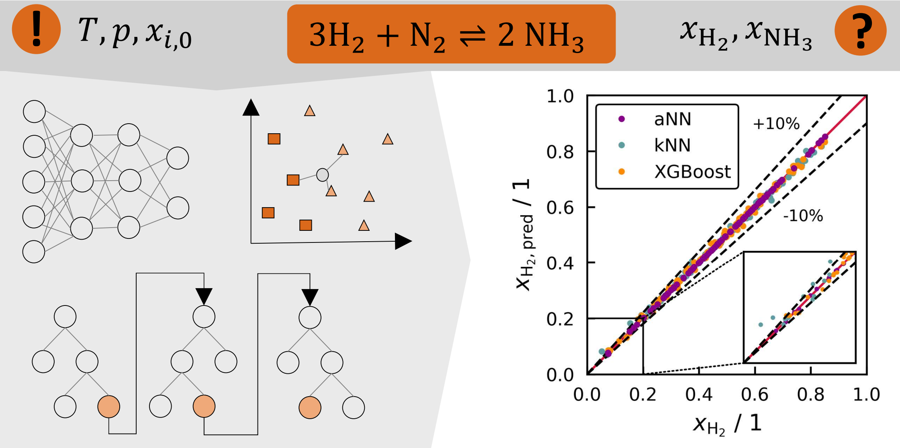

# Effiziente Berechnung des Reaktionsgleichgewichts mit KI-Methoden

## Beschreibung
In diesem Projekt werden Ersatzmodelle für die physikalische Berechnung des Reaktionsgleichgewichts getestet und optimiert. Als Beispielreaktion dient die Ammoniaksynthese. Es werden ein **neuronales Netz** (aNN), ein **K-Nearest-Neighbor Algorithmus** (kNN) und ein **XGBoost-Modell** (xgb) untersucht.

Alle Simulationen und Plots dieser Arbeit werden mit Python 3.10.9 umgesetzt und erstellt. In der Datei [bio-SR_03_23.txt](./bio-SR_03_23.txt) sind alle verwendeten Packages und ihre Versionen gelistet, sie kann zur Erstellung einer identischen Programmierumgebung genutzt werden.

## Benennug der Dateien
Die folgende Tabelle gibt einen Überblick über die Nummerierung und Benennung der Dateien in diesem Projekt. X dient als Platzhalter für eine Ziffer. Genauere Informationen zu dem durchgeführten Experiment in der jeweiligen Datei sind den Excel-Datein im Ordner [Experimente](./Experimente) zu entnehmen.
|Dateiname|Inhalt|
|:----------|:----------|
|001_XXX|Erzeugung der Gleichgewichtsdaten durch thermodynamische Berechnung mittels Shomate-Gleichungen|
|002_XXX|Experimente aNN; Output-Variable xi; Normalisierung mittels BatchNorm|
|003_XXX|Experimente aNN; Output-Variablen x_H2 und x_NH3; Normalisierung mittels BatchNorm|
|004_XXX|Experimente aNN; Output-Variablen xi; Prestandardization|
|005_XXX|Experimente aNN; Output-Variablen x_H2 und x_NH3; Prestandardization|
|006_XXX|Nachbau von aNN-Architekturen aus der Fachliteratur|
|007_XXX|Experimente kNN; Output-Variable xi|
|008_XXX|Experimente kNN; Output-Variablen x_H2 und x_NH3|
|009_XXX|Nachbau von kNN-Modellen aus der Fachliteratur|
|010_XXX|xgb-Modelle; umgesetzt mit scikit-learn|
|011_XXX|Experimente xgb; umgesetzt mit XGBoost-Learning API|
|012_XXX|Experimente xgb; umgesetzt mit XGBoost-Learning API; größerer Datensatz|
|XXX_XXX_001|Erweiterte Auswertung des Modells XXX_XXX|
|AA_XXX|Vergleichende Auswertung aNN|
|AK_XXX|Vergleichende Auswertung kNN|
|AB_XXX|Vergleichende Auswertung xgb|
|AV_XXX|Vergleichende Auswertung der verschiedenen Modelle|

## Beste Ersatzmodelle
Nach der Optimierung wurde für jede getestete ML-Methode das jeweils leistungstärkste Modell bestimmt. Die besten Modelle für jede Methode sind in der folgengen Tabelle gelistet.
|ML-Modell|Dateiname|
|:----------|:----------|
|aNN|005_020|
|kNN|008_003|
|xgb|011_027|

## Kontakt
Sina Ramsayer, Mat-Nr.: 1063115

Betreuer: Theresa Kunz, Hannes Stagge  
Angefertigt am: Institut für Chemieingenieurwesen  
Abgabe Abschlussarbeit: 09.10.23

Bei Fragen zum Projekt bin ich per Mail (sina.ramsayer@uni-ulm.de) erreichbar.

