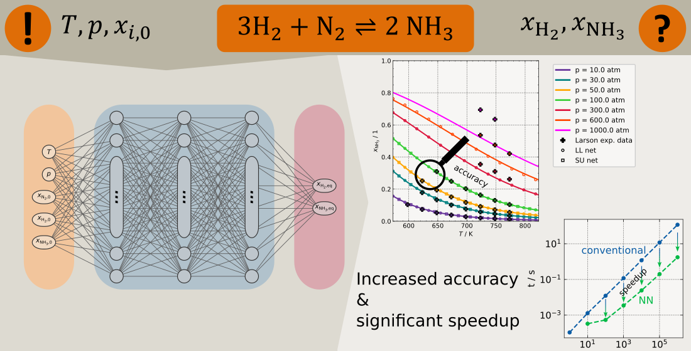

# Effiziente Berechnung des Reaktionsgleichgewichts mit KI-Methoden

## Beschreibung
Short Abstract

The file [conda_env.txt](./conda_env.txt) lists all used packages to run the training data generation and network training.

## Folder structure
The following chart gives an overview over the available files:
|Folder|contains|
|:----------|:----------|
|figures|All figures used in the associated publication|
|lib_nets/GGW_calc| module for calculating equilibrium with conventional stoichiometric method|
|lib_nets/Nets| module for constructing and evaluating artificial neural network described in the associated publication|
|HSA_001_XXX/data|Erzeugung der Gleichgewichtsdaten durch thermodynamische Berechnung mittels Shomate-Gleichungen|
|HSA_001_XXX/evaluation|results depicted in associated publication|
|HSA_001_XXX/examples|simple example how to initialize a network from save file|
|HSA_001_XXX/timing|code to time the program execution times|
|HSA_001_XXX/nets|code for network training|
|model|all trained network parameters in .pt format; models ready for use|

## Contact
Prof. Dr.-Ing. Robert Güttel (robert.guettel@uni-ulm.de),

Hannes Stagge, M.Sc. (hannes.stagge@uni-ulm.de),

Therea Kunz, M.Sc. (theresa.kunz@uni-ulm.de),

Sina Ramsayer, B.Sc.

Institute of Chemical Engineering  
Ulm University

